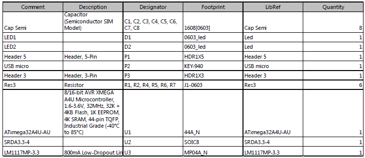
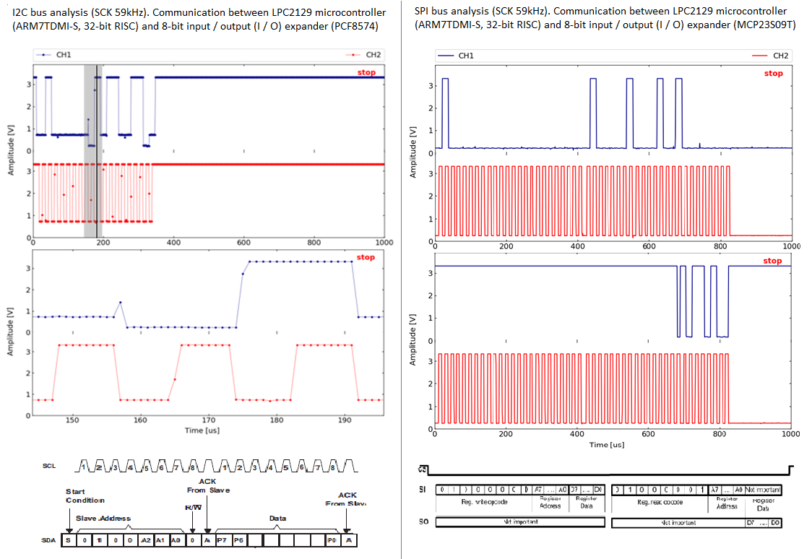

# MiniOscilloscope

Design and implementation of a miniature oscilloscope module with a usb interface. The main use of the module is monitoring the signals SPI and I2C interfaces. The repository is a patchwork of files that makes entire project. More accurate information about the project can be found in the ./docs/ (unfortunately Polish language)

Project of the MiniOscilloscope includes: 
  + PCB design and assembly, 
  + program for XMEAGA 32A4-AU microcontroller written in C,
  + GUI run on PC written in Python,
  + system tests.

## Table of Contents

1. [Requirements](#requirements) 
1. [System architecture](#system-architecture)
1. [MiniOscilloscope module](#minioscilloscope-module)
	+ [Schematic](#schematic)
	+ [BOM](#bom)
	+ [PCB design](#pcb-design)
	+ [Microcontroller program](#microcontroller-program)
1. [User application](#user-application)
1. [Tests](#tests)
	+ [Functional tests](#functional-tests)
	+ [Comparison USB and UART](#comparison-usb-and-uart)

## Requirements

#### Acquisition parameters:
- time resolution of at least 15 samples per clock cycle (SPI / I2C)
- 8bit voltage resolution
- input voltage range 0 - 3.3V
- two channels
- trigger signal input
- trigger mode: normal
#### Parameters of the printed circuit:
- minimum sizes
- two-layer
- elements on one side of PCB
- possibility of manual PCB assembly
#### Electrical parameters:
- power supply from USB
- surge protection
#### User application:
- displays observed signals in real time
- allows you to manipulate presented graph
- allows you to stop/start acquisition
Other:
- minimal construction cost
- data transmission to PC using the USB interface
- test signal output

## System architecture

<p align="center">
  
</p>

**[Back to top](#table-of-contents)**

## MiniOscilloscope module

### Schematic

<p align="center">
  
</p>


### BOM

<p align="center">
  
</p>

### PCB design

The PCB was designed in accordance with the assumptions set in Requirements paragraph. Parameters of the printed circuit:
- dimensions: 22 x 32 mm,
- two-layer circuit,
- min track width: 8 mil
- min space between tracks: 6 mil
- min hole: 0.45 mm
- min border: 11 mil
- descriptions: TOP layer

<p align="center">
  
</p>

### Microcontroller program

Complete source code in ./source/Xmega/

```C
int main(void)
{
	sysclk_init();
	pmic_init();
	adc_init();
	dma_init();
	evsys_init();
	tc_init();
	ioport_init();
	
	ioport_set_pin_dir(IO_TRIGGER, IOPORT_DIR_INPUT);
	ioport_set_pin_mode(IO_TRIGGER, IOPORT_MODE_PULLUP);
	ioport_set_pin_dir(IO_CTRL_LED, IOPORT_DIR_OUTPUT);
	
	cpu_irq_enable();
	adc_enable(&ADCA);
	pwm_enable();
	udc_start();
	
	while (1)
	{
		while(!udi_cdc_getc());
		while (0 == ioport_get_pin_level(IO_TRIGGER));
		while (1 == ioport_get_pin_level(IO_TRIGGER));
		
		dma_channel_enable(DMA_CHANNEL_0);
		dma_channel_enable(DMA_CHANNEL_1);

		if (udi_cdc_is_tx_ready())
		{
			while(dma_channel_is_busy(DMA_CHANNEL_1));
			udi_cdc_write_buf(&buffer_samples, RAM_BUFFER_SIZE_2000);
			ioport_toggle_pin_level(IO_CTRL_LED);
		}
	}
}
```

**[Back to top](#table-of-contents)**

## User application

Complete source code in ./source/Gui/

```python
from Gui import *
import serial

SAMPLES_NR=1000
CHANNEL_NR=2

serial_port = serial.Serial(port = 'COM3', write_timeout=0.1, inter_byte_timeout=0.1)
serial_port.flushInput()
RTS= bytearray(b'\xff')

gui=GUI(CHANNEL_NR,SAMPLES_NR)
paused = False

while True:

    key  = gui.get_key()
    if key == ' ':
        paused = not paused
        gui.toggle_state()
    elif key  == 'escape':
        break

    if not paused:
        try:
            serial_port.flushInput()
            serial_port.write(RTS)
            for channel in range(CHANNEL_NR):
                buffer = serial_port.read(SAMPLES_NR)
                gui.set_y(channel, buffer)
        except:
            pass

    gui.plot()
    gui.pause()
```

<p align="center">
  
</p>

**[Back to top](#table-of-contents)**

## Tests

### Functional tests

<p align="center">
  
</p>

### Comparison USB and UART

<p align="center">
  
</p>

**[Back to top](#table-of-contents)**
