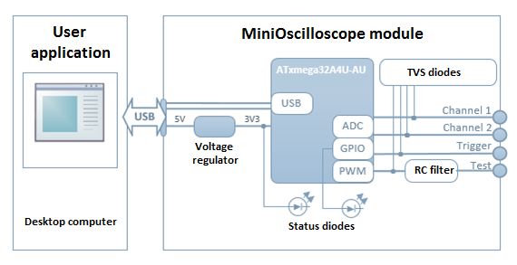
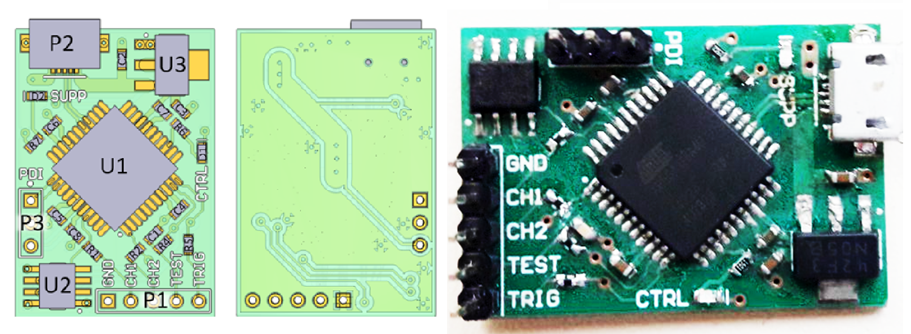

# MiniOscilloscope

Design and implementation of a miniature oscilloscope module with a usb interface. The main use of the module is monitoring the signals SPI and I2C interfaces.

## Table of Contents

1. [Requirements](#requirements) 
1. [System architecture](#system-architecture)
1. [MiniOscilloscope module](#miniOscilloscope-module)
	+ [Schematic](#schematic)
	+ [PCB design](#pcb-design)
	+ [Microcontroller program](#microcontroller-program)
1. [User application](#user-application)
1. [Tests](#tests)
	+ [Functional tests](#functional-tests)
	+ [Comparison USB and UART](#comparison-usb-and-uart)

## Requirements

#### Acquisition parameters:
- time resolution of at least 15 samples per clock cycle (SPI / I2C)
- 8bit voltage resolution
- input voltage range 0 - 3.3V
- two channels
- trigger signal input
- trigger mode: normal
#### Parameters of the printed circuit:
- minimum sizes
- two-layer
- elements on one side of PCB
- possibility of manual PCB assembly
#### Electrical parameters:
- power supply from USB
- surge protection
#### User application:
- displays observed signals in real time
- allows you to manipulate presented graph
- allows you to stop/start acquisition
Other:
- minimal construction cost
- data transmission to PC using the USB interface
- test signal output

## System architecture

  

**[Back to top](#table-of-contents)**

## MiniOscilloscope module
### Schematic

  

### PCB design

The PCB was designed in accordance with the assumptions set in Requirements paragraph. Parameters of the printed circuit:
- dimensions: 22 x 32 mm,
- two-layer circuit,
- min track width: 8 mil
- min space between tracks: 6 mil
- min hole: 0.45 mm
- min border: 11 mil
- descriptions: TOP layer

  

### Microcontroller program

**[Back to top](#table-of-contents)**

## User application

  

**[Back to top](#table-of-contents)**

## Tests
### Functional tests
### Comparison USB and UART

  

**[Back to top](#table-of-contents)**
